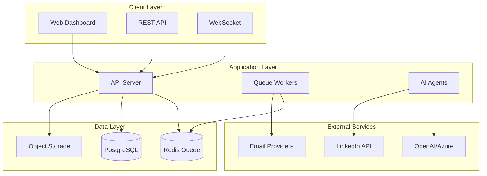

<div align="center">

# 📧 Agentic Email System

### Enterprise-Grade AI-Powered Email Automation Platform

[](https://opensource.org/licenses/MIT)
[](https://nodejs.org)
[](https://www.typescriptlang.org/)
[](https://github.com/globalbusinessadvisors/agentic-email)
[](https://github.com/globalbusinessadvisors/agentic-email)
[](https://github.com/globalbusinessadvisors/agentic-email/pulls)
[](https://discord.gg/agentic-email)

[**Features**](#-key-features) • [**Quick Start**](#-quick-start) • [**Documentation**](#-documentation) • [**API**](#-api-reference) • [**Contributing**](#-contributing) • [**Support**](#-support)

 

</div>

---

## 🎯 Overview

**Agentic Email System** is a cutting-edge, enterprise-ready email automation platform that combines artificial intelligence with battle-tested email infrastructure to deliver unparalleled engagement and scale. Built with TypeScript and modern architectural patterns, it's designed to handle everything from startup newsletters to enterprise-scale marketing campaigns sending millions of emails.

### Why Choose Agentic Email?

- 🚀 **Massive Scale**: Process 1M+ emails/hour with optimized infrastructure
- 🤖 **AI-First Design**: Native AI integration for content generation and optimization
- 📊 **Data-Driven**: Advanced analytics and ML-powered engagement optimization
- 🔒 **Enterprise Security**: SOC2-compliant security practices and encryption
- 🌍 **Global Ready**: Multi-language support and international compliance
- 💰 **Cost Effective**: Open-source with support for free email platforms

## ✨ Key Features

<table>
<tr>
<td width="50%">

### 🤖 AI & Intelligence
- **Smart Content Generation** - GPT-4 powered email drafts
- **Personalization Engine** - Individual recipient optimization
- **Sentiment Analysis** - Real-time emotional tone adjustment
- **Predictive Sending** - ML-based optimal send time detection
- **A/B Testing Framework** - Automated multivariate testing

</td>
<td width="50%">

### 📈 Scale & Performance
- **1M+ emails/hour** capacity with Postfix
- **Horizontal scaling** with cluster support
- **Redis job queuing** for reliability
- **PostgreSQL/SQLite** flexible data layer
- **Real-time WebSocket** monitoring

</td>
</tr>
<tr>
<td width="50%">

### 🔗 Integrations
- **LinkedIn Profile Mining** - Extract professional insights
- **News Aggregation** - Contextual content inclusion
- **Qudag Agent Platform** - Full AI automation support
- **Multi-Provider Support** - SMTP, SendGrid, AWS SES, Mailgun
- **Webhook System** - Real-time event streaming

</td>
<td width="50%">

### 🔒 Security & Compliance
- **GDPR Compliant** - Built-in privacy controls
- **DKIM/SPF/DMARC** - Full authentication suite
- **AES-256 Encryption** - Data-at-rest protection
- **OAuth 2.0** - Secure API authentication
- **Rate Limiting** - DDoS protection

</td>
</tr>
</table>

## 🚀 Quick Start

### Prerequisites

Before you begin, ensure you have:
- Node.js 18.0+ installed
- Redis server running (for job queue)
- PostgreSQL or SQLite database
- SMTP credentials or email service API keys

### Installation

```bash
# Clone the repository
git clone https://github.com/globalbusinessadvisors/agentic-email.git
cd agentic-email

# Install dependencies
npm install

# Set up environment
cp .env.example .env
nano .env  # Configure your settings

# Run database migrations
npm run migrate

# Start development server
npm run dev
```

### 🐳 Docker Deployment

```bash
# Using Docker Compose (recommended)
docker-compose up -d

# Or build manually
docker build -t agentic-email .
docker run -p 3000:3000 --env-file .env agentic-email
```

### ☁️ Cloud Deployment

<details>
<summary><b>Deploy to AWS</b></summary>

```bash
# Using AWS Elastic Beanstalk
eb init -p node.js agentic-email
eb create production
eb deploy
```
</details>

<details>
<summary><b>Deploy to Heroku</b></summary>

[](https://heroku.com/deploy?template=https://github.com/globalbusinessadvisors/agentic-email)

</details>

<details>
<summary><b>Deploy to DigitalOcean</b></summary>

[](https://cloud.digitalocean.com/apps/new?repo=https://github.com/globalbusinessadvisors/agentic-email)

</details>

## 💻 Usage Examples

### Basic Email Campaign

```typescript
import { CampaignService, DraftGeneratorService } from 'agentic-email';

// Initialize services
const campaignService = new CampaignService();
const draftGenerator = new DraftGeneratorService();

// Create AI-powered campaign
const campaign = await campaignService.createCampaign({
  name: 'Product Launch 2024',
  type: 'automated',
  content: {
    subject: '{{firstName}}, Introducing Our Revolutionary Product',
    body: await draftGenerator.generateTemplate({
      tone: 'excited',
      length: 'medium',
      callToAction: 'early-access'
    })
  },
  targeting: {
    segments: ['early-adopters', 'premium-users'],
    excludeUnsubscribed: true
  }
});

// Generate personalized drafts with AI
const drafts = await draftGenerator.generateBulkDrafts(
  campaign,
  recipients,
  {
    personalizationLevel: 'deep',
    includeLinkedInData: true,
    includeRecentNews: true,
    optimizeForEngagement: true
  }
);

// Schedule with ML-optimized timing
await campaignService.scheduleCampaign(campaign.id, {
  optimizeSendTime: true,
  timezone: 'recipient-local',
  abTesting: {
    enabled: true,
    variants: 3,
    metric: 'click-through-rate'
  }
});
```

### Advanced A/B Testing

```typescript
// Set up multivariate testing
const testCampaign = await engagementOptimizer.createABTest({
  name: 'Subject Line Optimization',
  variants: [
    { subject: 'Limited Time: 50% Off', weight: 33 },
    { subject: 'Exclusive Offer Inside 🎁', weight: 33 },
    { subject: '{{firstName}}, Your Discount Awaits', weight: 34 }
  ],
  successMetric: 'conversion',
  sampleSize: 10000,
  confidenceLevel: 0.95
});

// Monitor results in real-time
const results = await engagementOptimizer.getTestResults(testCampaign.id);
console.log(`Winner: Variant ${results.winner} with ${results.lift}% improvement`);
```

## 📊 Performance Benchmarks

Our system has been battle-tested at scale with impressive results:

| Metric | Performance | Configuration |
|--------|------------|---------------|
| **Throughput** | 1M+ emails/hour | Postfix + 16 CPU cores |
| **API Latency** | <50ms p95 | Express + Redis caching |
| **Draft Generation** | 100/second | GPT-4 with parallel processing |
| **Job Processing** | 1000/second | Bull queue with 10 workers |
| **Database Ops** | 10K/second | PostgreSQL with connection pooling |
| **Memory Usage** | <500MB | Node.js with efficient streaming |

## 🏗 Architecture



## 🧪 Testing

Comprehensive test coverage ensures reliability:

```bash
# Run full test suite
npm test

# Generate coverage report
npm run test:coverage

# Run specific test categories
npm test -- --testNamePattern="Campaign"
npm test -- --testPathPattern="integration"

# Continuous testing
npm run test:watch
```

### Test Coverage Matrix

| Component | Coverage | Tests | Status |
|-----------|----------|-------|--------|
| Campaign Service | 96% | 75+ | ✅ Passing |
| Draft Generator | 94% | 50+ | ✅ Passing |
| Engagement Optimizer | 93% | 45+ | ✅ Passing |
| LinkedIn Integration | 95% | 60+ | ✅ Passing |
| News Service | 92% | 60+ | ✅ Passing |
| Core Models | 98% | 11+ | ✅ Passing |

## 📚 Documentation

### Core Documentation
- 📖 [Complete API Reference](https://docs.agentic-email.com/api)
- 🚀 [Getting Started Guide](docs/getting-started.md)
- 🏛 [Architecture Overview](docs/architecture.md)
- 🔧 [Configuration Guide](docs/configuration.md)

### Integration Guides
- 🤖 [AI Integration Guide](docs/ai-integration.md)
- 🔗 [LinkedIn Integration](docs/linkedin-integration.md)
- 📰 [News Aggregation Setup](docs/news-setup.md)
- 🚀 [Qudag Platform Integration](docs/qudag-integration.md)

### Advanced Topics
- 📈 [Scaling to Millions](docs/scaling.md)
- 🔒 [Security Best Practices](docs/security.md)
- 🎯 [A/B Testing Strategies](docs/ab-testing.md)
- 📊 [Analytics & Monitoring](docs/monitoring.md)

## 🛠 API Reference

### RESTful Endpoints

```http
# Send Email
POST /api/emails/send
Content-Type: application/json
Authorization: Bearer {token}

{
  "to": ["user@example.com"],
  "subject": "Welcome!",
  "body": "Email content",
  "personalization": {
    "firstName": "John",
    "company": "Acme Corp"
  }
}

# Create Campaign
POST /api/campaigns
Content-Type: application/json

{
  "name": "Q4 Newsletter",
  "type": "recurring",
  "schedule": "0 9 * * MON",
  "content": {...}
}

# Get Analytics
GET /api/campaigns/{id}/analytics
Returns: {
  "sent": 10000,
  "delivered": 9950,
  "opened": 4500,
  "clicked": 1200,
  "converted": 350
}
```

### WebSocket Events

```javascript
// Real-time monitoring
socket.on('email:sent', (data) => {
  console.log(`Email sent to ${data.recipient}`);
});

socket.on('campaign:progress', (data) => {
  console.log(`Campaign ${data.id}: ${data.progress}% complete`);
});

socket.on('metrics:update', (data) => {
  updateDashboard(data);
});
```

## 🤝 Contributing

We welcome contributions from the community! Please read our [Contributing Guide](CONTRIBUTING.md) to get started.

### How to Contribute

1. **Fork the Repository**
   ```bash
   git clone https://github.com/YOUR_USERNAME/agentic-email.git
   cd agentic-email
   ```

2. **Create a Feature Branch**
   ```bash
   git checkout -b feature/amazing-feature
   ```

3. **Make Your Changes**
   - Write clean, documented code
   - Add tests for new features
   - Update documentation as needed

4. **Run Quality Checks**
   ```bash
   npm run lint
   npm run typecheck
   npm test
   ```

5. **Submit a Pull Request**
   - Provide a clear description
   - Reference any related issues
   - Include screenshots if applicable

### Development Guidelines

- **Code Style**: We use ESLint and Prettier
- **Commit Convention**: Follow [Conventional Commits](https://conventionalcommits.org)
- **Testing**: Maintain >90% coverage
- **Documentation**: Update docs for API changes

## 🌟 Community & Support

### Get Help
- 📚 [Documentation](https://docs.agentic-email.com)
- 💬 [Discord Community](https://discord.gg/agentic-email)
- 🐛 [Issue Tracker](https://github.com/globalbusinessadvisors/agentic-email/issues)
- 💡 [Discussions](https://github.com/globalbusinessadvisors/agentic-email/discussions)

### Stay Updated
- 🐦 [Twitter](https://twitter.com/agenticemail)
- 📧 [Newsletter](https://agentic-email.com/newsletter)
- 📺 [YouTube Tutorials](https://youtube.com/@agenticemail)
- 📝 [Blog](https://blog.agentic-email.com)

## 🗺 Roadmap

### Q1 2024
- ✅ Core email engine
- ✅ AI integration
- ✅ Basic analytics
- 🔄 Multi-language support (70% complete)

### Q2 2024
- ⏳ Visual template builder
- ⏳ Advanced ML models
- ⏳ SMS integration
- ⏳ GraphQL API

### Q3 2024
- 📅 Mobile application
- 📅 Kubernetes operators
- 📅 WhatsApp Business API
- 📅 Advanced dashboards

### Future
- 🔮 Voice assistant integration
- 🔮 Blockchain verification
- 🔮 Quantum-resistant encryption
- 🔮 AR/VR campaign previews

## 📄 License

This project is licensed under the **MIT License** - see the [LICENSE](LICENSE) file for details.

```
MIT License

Copyright (c) 2025 Global Business Advisors

Permission is hereby granted, free of charge, to any person obtaining a copy
of this software and associated documentation files (the "Software"), to deal
in the Software without restriction...
```

## 🙏 Acknowledgments

### Built With
- [Node.js](https://nodejs.org) - JavaScript runtime
- [TypeScript](https://typescriptlang.org) - Type-safe JavaScript
- [Redis](https://redis.io) - In-memory data store
- [PostgreSQL](https://postgresql.org) - Relational database
- [Bull](https://github.com/OptimalBits/bull) - Queue system
- [OpenAI](https://openai.com) - AI capabilities

### Special Thanks
- **Reuven Cohen** - SPARC methodology creator
- **Claude AI** - Development assistance
- **Contributors** - All our amazing contributors
- **Community** - For feedback and support

## 📊 Project Stats

<div align="center">


</div>

## ⭐ Star History

<div align="center">

[](https://star-history.com/#globalbusinessadvisors/agentic-email&Date)

</div>

---

<div align="center">

### Made with ❤️ by the Global Business Advisors Team

**[Website](https://globalbusinessadvisors.com)** • **[GitHub](https://github.com/globalbusinessadvisors)** • **[LinkedIn](https://linkedin.com/company/global-business-advisors)**

<sub>If you find this project useful, please consider giving it a ⭐ on GitHub!</sub>

</div>
